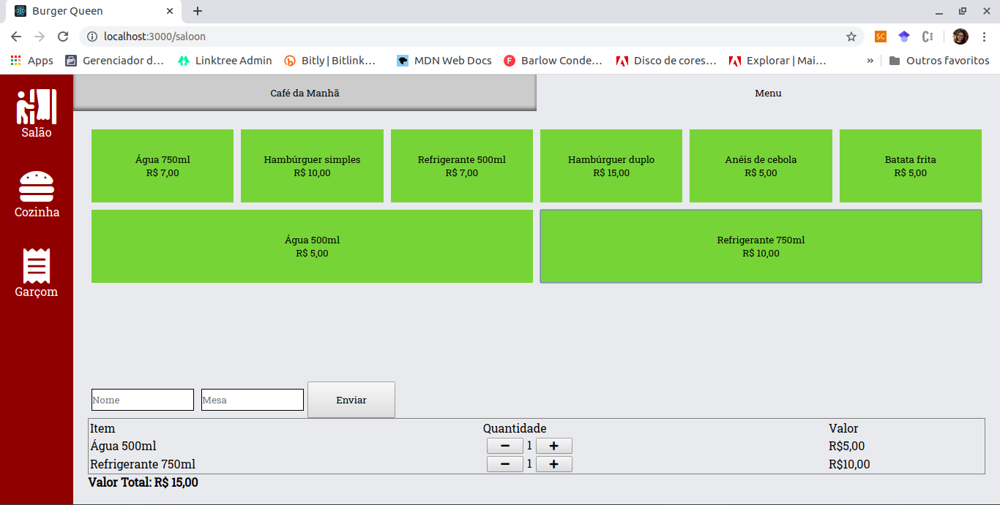
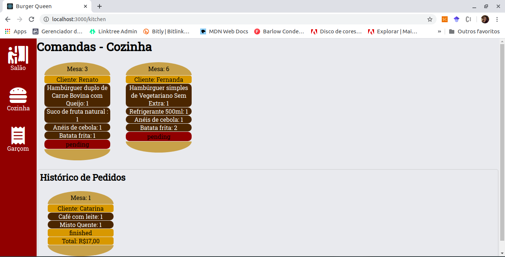
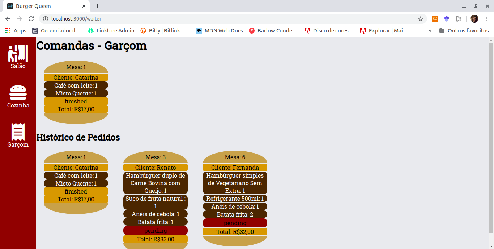

# Burger Queen

## Índice

- [1. Resumo](#1-resumo)
- [2. Objetivo](#2-objetivo)
- [3. História de Usuário](#3-história-de-usuário)
- [4. Ferramentas](#4-ferramentas)

---

## 1. Resumo

Com a tecnologia dominando cada vez mais nosso dia a dia, o mercado vem se adaptando e modernizando sua forma de atedimento ao cliente.

Pensando na modernização do atendimento em Fast-Foods/Restaurantes foi desenvolvida a aplicação com o objetivo de fazer a comanda e enviar a cozinha, este quando preparado informa ao garçom que o pedido está pronto para a entrega.

## 2. Objetivo

O objetivo principal é aprender a construir uma interface web usando React. Esse framework front-end ataca o seguinte problema: como manter a interface e estado sincronizados. Portanto, esta experiência espera familiarizá-la com o conceito de estado da tela, e como cada mudança no estado vai refletir na interface (por exemplo, toda vez que adicionamos um produto para um pedido, a interface deve atualizar a lista de pedidos e o total).## 2. Objetivo
rface deve ser pensada específicamente para rodar em tablets.

## 3. História de Usuário

[História de usuário 1] - Garçom/Garçonete deve poder anotar o seu pedido.

Eu como garçom/garçonete quero poder anotar o meu pedido saber o valor de cada produto e poder enviar o pedido para a cozinha para ser preparado.

- Anotar o nome e mesa.
- Adicionar produtos aos pedidos.
- Excluir produtos.
- Ver resumo e o total da compra.
- Enviar o pedido para a cozinha (guardar em algum banco de dados).
- Funcionar bem e se adequar a um tablet.

[História de usuário 2] - Chefe de cozinha deve ver os pedidos

Eu como chefe de cozinha quero ver os pedidos dos clientes em ordem, poder marcar que estão prontos e poder notificar os garçons/garçonetes que o pedido está pronto para ser entregue ao cliente.

- Ver os pedidos à medida em que são feitos.
- Marcar os pedidos que foram preparados e estão prontos para serem servidos.
- Ver o tempo que levou para preparar o pedido desde que chegou, até ser marcado como concluído.

[História de usuário 3] - Garçom/Garçonete deve ver os pedidos prontos para servir

Eu como garçom/garçonete quero ver os pedidos que estão prontos para entregá-los rapidamente aos clientes.

- Ver a lista de pedidos prontos para servir.
- Marque os pedidos que foram entregues.

## 4. Ferramentas
- JavaScript (ES6 +)
- React Hooks
- Aphrodite CSS
- Firebase

Para visualizar a Aplicação: [Burger Queen](https://burgerqueen-9fe2e.firebaseapp.com)

